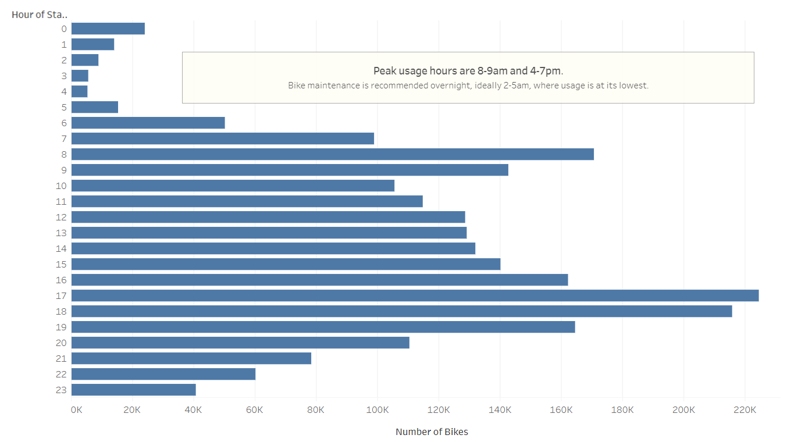
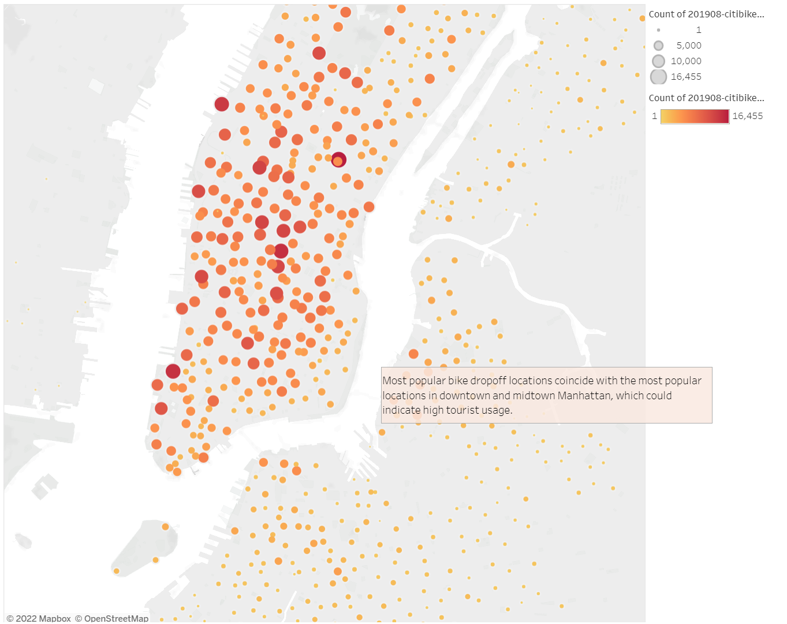
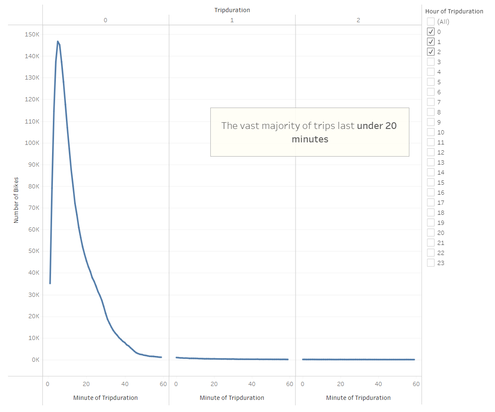
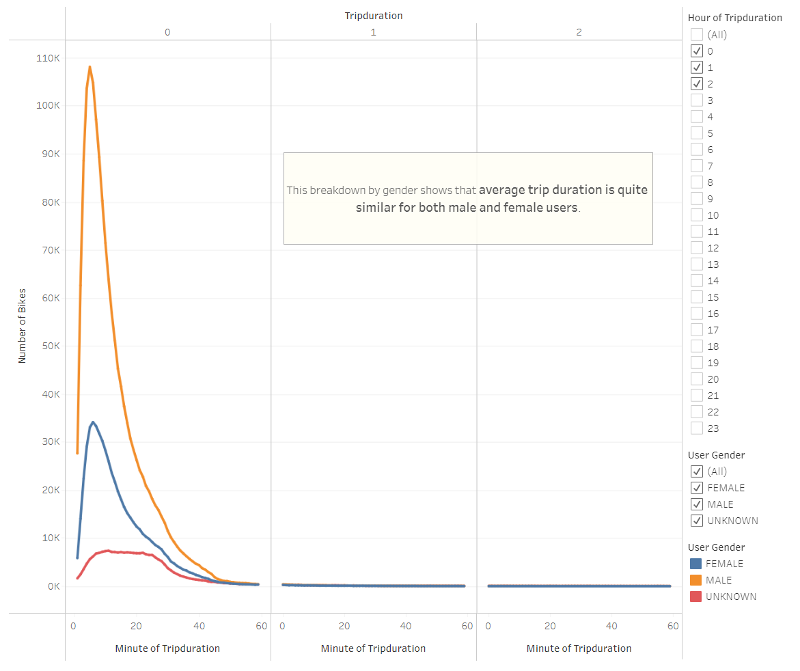
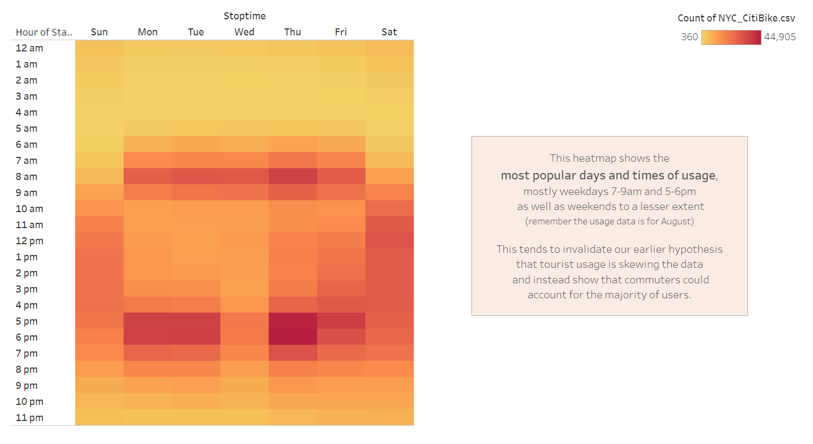
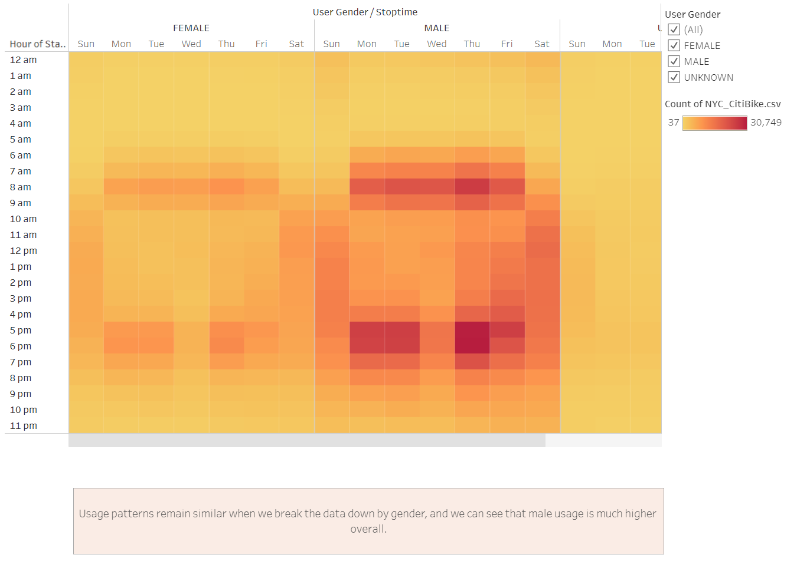
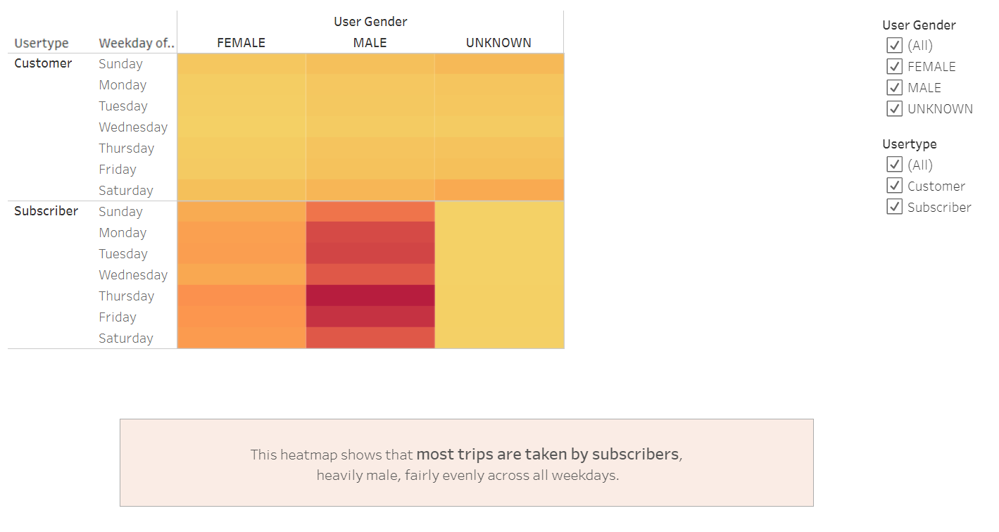

NYC CitiBike

# Project Overview

After a very enjoyable holiday in New York City we decide to explore the business opportunity to launch a bike sharing service in our hometown of Des Moines, IA. Our friend Kate has a potential seed investor interested in our project and we must dive deeper into the mechanics of how the bike sharing service works in NYC before we can adapt the model to Des Moines.

# Results

A summary of our results is available below, and the full interactive results of our analysis are available on Tableau Public here:
https://public.tableau.com/views/Module14_16644928543210/Challenge?:language=en-GB&publish=yes&:display_count=n&:origin=viz_share_link

## Peak Hours

Peak usage hours are 5-6pm and to a lesser extent 8-9am. Bike maintenance is recommended overnight, ideally 2-5am, while usage is at its lowest.
 
(click the image to enlarge)
 

## Checkout Locations

Most popular bike drop-off locations coincide with the most popular locations in downtown and midtown Manhattan, which could indicate high tourist usage. Further down, we will test that hypothesis and investigate whether tourists or commuters account for the larger share of bike usage.
  
(click the image to enlarge)
 

## Trip Duration

From the chart here, we can see that the vast majority of trips last less than 20 minutes, and 5min trips are the most common.
  
(click the image to enlarge)
 

## Trip Duration by Gender

This breakdown by gender shows that average trip duration is quite similar for both male and female users.
  
(click the image to enlarge)
 

## Usage by Weekday per Hour

This heatmap shows the most popular days and times of usage, mostly weekdays 7-9am and 5-6pm, as well as weekends to a lesser extent (note: the data is for August, when the weather in NYC is comfortable, but winter data might yield different results). This tends to invalidate our earlier hypothesis that tourist usage is skewing the data and instead tend to show that commuters account for the majority of trips.
  
(click the image to enlarge)
 

## Usage by Gender by Weekday per Hour

Usage patterns remain similar when we break the data down by gender, and we can see that male usage is much higher overall.
  
(click the image to enlarge)
 

## Usage by Gender and Weekday

This heatmap shows that most trips are taken by subscribers, overwhelmingly male, and fairly evenly across all weekdays.
  
(click the image to enlarge)
 

# Summary
Users of the CitiBike service in New York City are typically male subscribers to the service who commute to/from work. Typical trips last about 5min (with the vast majority under 20min) and start and end mostly in downtown and midtown Manhattan.

# Recommendations
To continue evaluating our business opportunity in Des Moines, IA it will be critical to:
1. create three new visualizations of trip durations and start/end points on weekday peak hours, weekday midday and weekends to try and establish three different sets of patterns and user profiles. This would possibly show short trips to commute to work on weekday peak hours, tourist/occasional trips around the city  (by filtering by subscribers/non-subscribers) and leisure/exercise trips on the weekend.

And with additional data:
2. repeat the entire analysis for other months of the year to determine monthly/seasonal changes.
3. plug in weather data to evaluate the impact of temperatures and precipitations on bike usage.
